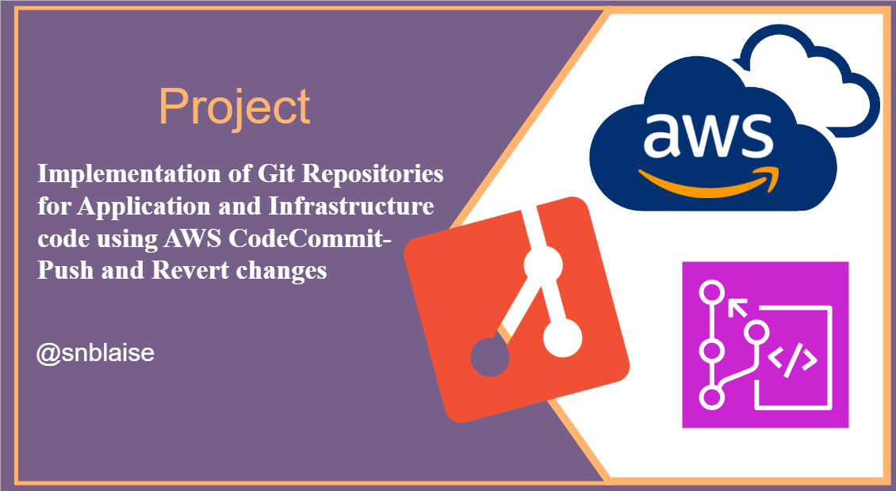

## MASTERING GIT :

## **Project Title: Implementation Of Git Repositories For Application And Infrastructure Code Using AWS Code Commit**



**Introduction:**
Throughout our Mastering Git journey, we've embarked on an incredible learning adventure, spanning from the fundamentals of Git to practical implementation on AWS CodeCommit. Now, let's take a deep dive into our final project, where we put our knowledge to the test. Buckle up, because this is where theory meets practice!

**Project description**
In this project based on a real-world scenario, I implemented Git repositories for application and infrastructure code using AWS CodeCommit and got hands-on experience with the Proof of Concept (PoC) process of committing, pushing, and reverting code changes. 

My mission was to set up a Git repository using AWS CodeCommit for HumanGov, a hypothetical Software as a Service for government organizations. 


# Hands-on Project: Version Control with Git and AWS CodeCommit - Implementation

## Project Task 1: Creating Git Repositories on AWS CodeCommit and Establishing Connections on AWS Cloud9
3
Our journey begins with setting up the groundwork for our version control system.

### Step 1: Creating Two Repositories on AWS CodeCommit

We kick things off by creating two repositories on AWS CodeCommit:

- **human-gov-application**
- **human-gov-infrastructure**

### Step 2: Configuring AWS CLI Credential Helper on AWS Cloud9

To seamlessly connect AWS Cloud9 with AWS CodeCommit, we configure the AWS CLI credential helper:

```bash
# Config for DevOps Engineer
git config --global user.name "Blaise Ngwa - DevOps Engineer"
git config --global user.email nblaise@humangov.com
git config --global credential.helper '!aws codecommit credential-helper $@'
git config --global credential.UseHttpPath true
```

### Step 3: Cloning the Repositories

With the setup complete, we clone the repositories to our local environment:

```bash
git clone <https://git-codecommit.us-east-1.amazonaws.com/v1/repos/human-gov-infrastructure>
git clone <https://git-codecommit.us-east-1.amazonaws.com/v1/repos/human-gov-application>
```

## Project Task 2: Performing Proof of Concept (PoC) of Commit, Push, and Revert Operations Using AWS Cloud9

Now, let's immerse ourselves in the development process and simulate real-world scenarios.

### As Software Developer 1:

We step into the shoes of Software Developer 1 and configure a Cloud9 environment accordingly:

```bash
git config --global user.name "Software Developer 1"
git config --global user.email dev1@humangov.com
git config --global credential.helper '!aws codecommit credential-helper $@'
git config --global credential.UseHttpPath true
```

After cloning the `human-gov-application` repository, we create an `index.html` file, commit it, and make our first push:

```html
<!-- index.html -->
<!DOCTYPE html>
<html>
<head>
<title>My Website</title>
</head>
<body>
<header>
<h1>Welcome to HumanGov!</h1>
<nav>
<ul>
<li><a href="#">Home</a></li>
<li><a href="#">About</a></li>
<li><a href="#">Contact</a></li>
</ul>
</nav>
</header>
<main>
<p>This is a PoC for HumanGov Git Repository.</p>
</main>
<footer>
<p>© My Website. All rights reserved.</p>
</footer>
</body>
</html>
```

Committing and pushing:

```bash
git add .
git commit -m "first commit"
git push -u origin master
```

### As Software Developer 2:

Now, let's switch roles to Software Developer 2. We configure a Cloud9 environment for this role and clone the `human-gov-application` repository.

We introduce a typo in the header, commit it, and then revert the last commit. We then change the header to H2, commit the fix, and push the changes:

```bash
git log
git revert <hash>
# Change the header to H2
git add .
git commit -m "fixed header size"
git status
git push -u origin master
```

## Final Task:

Our journey nears its end as we complete some housekeeping tasks:

1. We gracefully retire the Cloud9 environments created for Software Developer 1 and Software Developer 2.
2. Capturing key moments, we take screenshots of the remaining Cloud9 environment, the AWS CodeCommit main screen displaying both repositories, and the commit activity in the `human-gov-application` repository.

# Key Takeaways

As we wrap up this remarkable journey, let's reflect on the core lessons we've learned:

1. **Git Fundamentals:** We've mastered the basics of Git, understanding its essential commands and version control concepts.
2. **Collaboration:** Git enables smooth collaboration among team members, allowing us to work on projects simultaneously.
3. **Revert and Correct:** We've seen how Git empowers us to revert changes and correct mistakes with ease.
4. **GitHub Integration:** Our integration with GitHub showcases how DevOps engineers use version control in real-world scenarios.
5. **CodeCommit:** We've explored AWS CodeCommit as a secure, scalable, and fully managed version control service.

With these takeaways in mind, we're now equipped to navigate the intricate landscape of version control and DevOps confidently. Remember, every line of code we've written and every challenge we've faced has paved the way for our continued growth in this dynamic field. Keep coding, keep learning, and let your journey into the world of DevOps and version control be an inspiring one! 🚀🌟 #DevOpsJourney #GitMastery #AWSCodeCommit #VersionControl #LearnDevOps
